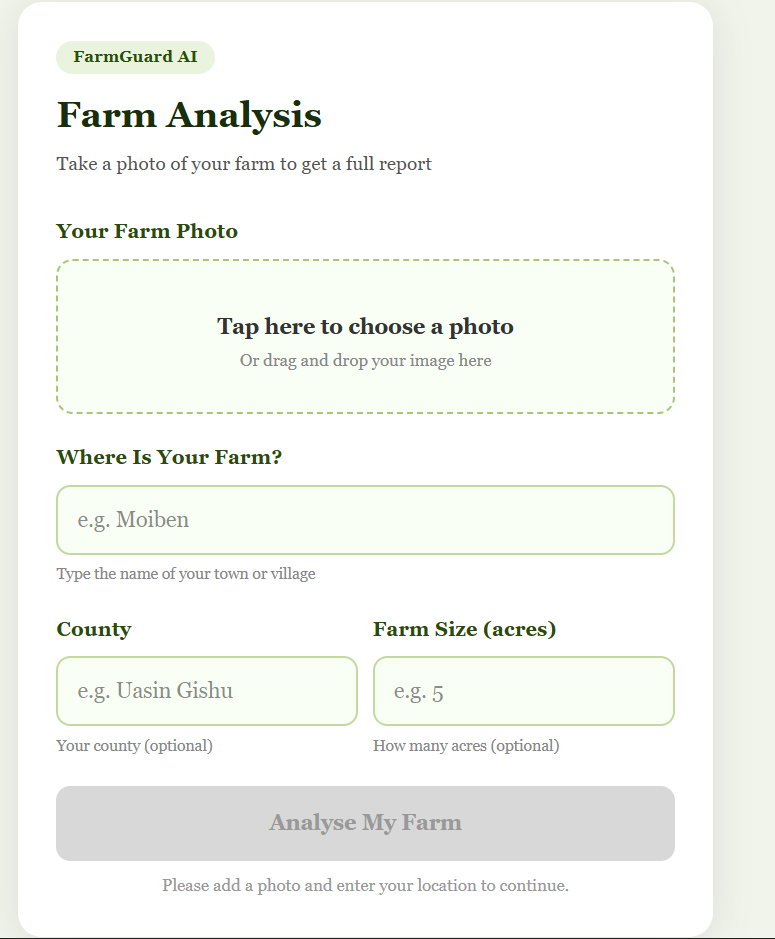
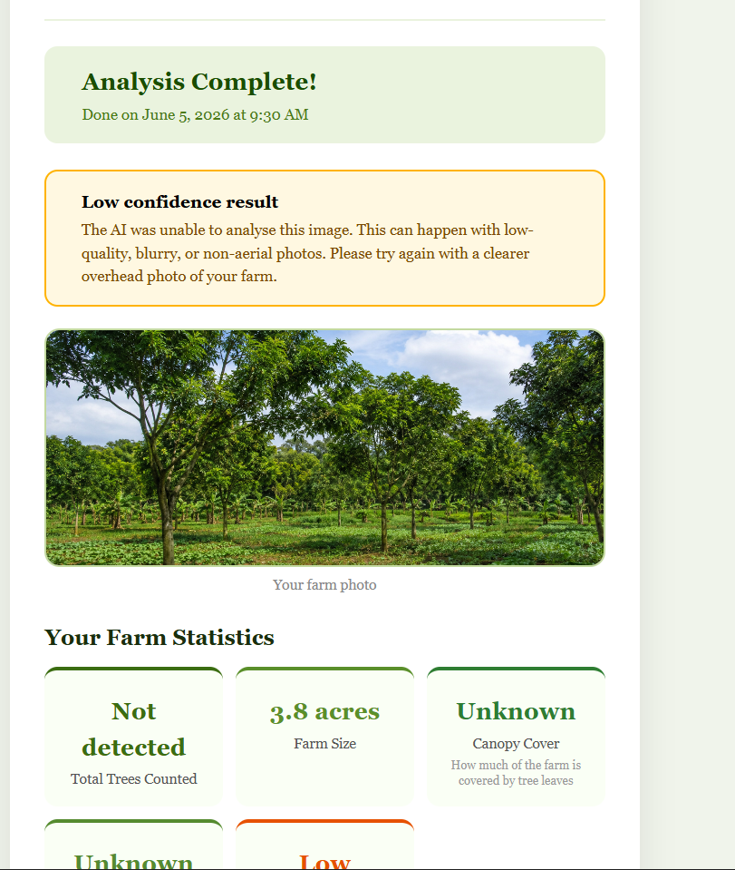

#  FarmGuard AI

> AI-powered farm analysis — upload a photo, get a full agronomic report in seconds.


---

## What is FarmGuard AI?

FarmGuard AI lets farmers and agronomists drop a drone or aerial photo of their land and instantly receive a detailed, AI-generated report — covering tree count, canopy coverage, per-acre tree density, health breakdown, and specific recommendations on what needs attention.

No spreadsheets. No guesswork. Upload → Analyse → Act.

Built on top of the [Weather-AI Trees & Forestry API](https://weather-ai.co), which combines OpenCV computer vision with Gemini AI to deliver accurate, context-aware results.

---

## Screenshots

| Upload | Results |
|--------|---------|
|  |  |

---

## Features

- **Drag-and-drop image upload** — JPEG, PNG, WebP supported, up to 10 MB
- **Detailed farm report** — tree count, canopy %, trees/acre, health status per tree
- **AI observations & recommendations** — powered by Gemini via WeatherAI
- **Low-confidence detection** — warns users when image quality is insufficient rather than showing misleading data
- **Metadata support** — pass county, location, farm size, and GPS coordinates for richer AI context
- **Clean, responsive UI** — works on desktop and mobile

---

## Tech Stack

| Layer | Technology |
|---|---|
| Frontend | React 18, TypeScript, Vite |
| Styling | Plain CSS |
| Backend | Node.js, Express |
| HTTP Client | Axios |
| Image Upload | Multer |
| AI / CV Engine | WeatherAI Trees & Forestry API (OpenCV + Gemini) |

---

## Project Structure

```
farmguard-ai/
├── frontend/                  # React + TypeScript + Vite
│   ├── src/
│   │   ├── API/
│   │   │   └── farmApi.ts     # Typed API wrapper for backend calls
│   │   ├── App.tsx            # Root component — handles state & flow
│   │   ├── app.css            # Global styles
│   │   └── main.tsx           # Entry point
│   ├── .env                   # VITE_API_URL
│   └── vite.config.ts
│
└── backend/                   # Node.js + Express
    ├── config/
    │   └── env.js             # Centralised env config with validation
    ├── controllers/
    │   └── farmController.js  # analyzeFarm handler + healthCheck
    ├── utils/
    │   └── weatherAiClient.js # Axios instance — WeatherAI integration
    ├── routes/
    │   └── farm.js            # Route definitions
    ├── .env                   # API keys & server config
    └── server.js              # Express app entry point
```

---

## Getting Started

### Prerequisites

- **Node.js 18+**
- A **Weather-AI API key** — get one free at [weather-ai.co](https://weather-ai.co)

---

### 1. Clone the repository

```bash
git clone https://github.com/collins254collo/farmguard-ai.git
cd farmguard-ai
```

---

### 2. Backend setup

```bash
cd backend
npm install
```

Create a `backend/.env` file:

```env
PORT=5000
WEATHER_AI_API_KEY=your_api_key_here
WEATHER_AI_BASE_URL=https://api.weather-ai.co
WEATHER_AI_TREES_ENDPOINT=/v1/trees/analyze
ALLOWED_ORIGINS=http://localhost:3000
MAX_FILE_SIZE_MB=10
ALLOWED_MIME_TYPES=image/jpeg,image/png,image/webp,image/gif
```

Start the backend:

```bash
npm run dev
```

Backend runs at `http://localhost:5000`.

---

### 3. Frontend setup

```bash
cd ../frontend
npm install
```

Create a `frontend/.env` file:

```env
VITE_API_URL=http://localhost:5000/api
```

Start the frontend:

```bash
npm run dev
```

App runs at `http://localhost:3000`.

---

## API Reference

### `POST /api/farm/analyze`

Accepts a `multipart/form-data` payload and proxies it to the WeatherAI Trees API.

**Request fields:**

| Field | Type | Required | Description |
|---|---|---|---|
| `image` | File | ✅ | Farm photo (JPEG, PNG, WebP, GIF) |
| `location` | string | ✅ | Town or village name (e.g. `Moiben`) |
| `county` | string | ❌ | County name (e.g. `Uasin Gishu`) |
| `land_acres` | number | ❌ | Farm size in acres |
| `farmer_id` | string | ❌ | Optional farmer identifier |
| `latitude` | number | ❌ | GPS latitude |
| `longitude` | number | ❌ | GPS longitude |

**Success response:**

```json
{
  "success": true,
  "message": "Farm image analysed successfully",
  "data": {
    "analysis_id": "h52eGQVRDXhjjoFa1dT8",
    "timestamp": "2026-06-05T05:41:42.908Z",
    "location": "Moiben",
    "county": "Uasin Gishu",
    "land_acres": 3,
    "total_tree_count": 142,
    "tree_density_per_acre": 47,
    "confidence_score": 0.85,
    "canopy_coverage_pct": 38,
    "tree_health": {
      "healthy": 120,
      "needs_care": 18,
      "needs_replacement": 4
    },
    "low_confidence": false,
    "tree_species_guess": "Eucalyptus",
    "observations": ["Dense canopy in northern section"],
    "recommendations": ["Consider thinning in the northern block"]
  }
}
```

---

### `GET /api/farm/health`

Returns backend status and confirms the WeatherAI API key is configured.

```json
{ "status": "ok", "apiKeyConfigured": true }
```

---

## Frontend API Module

All backend calls are made through a single typed wrapper — `src/API/farmApi.ts`:

```ts
import analyseFarm from './API/farmApi';

const result = await analyseFarm(imageFile, location, county, acres);
```

`BASE_URL` is read from `VITE_API_URL` and falls back to `http://localhost:5000/api` in development.

---

## How Results Are Handled

FarmGuard AI treats data integrity seriously:

- **Successful analysis** → displays the full stats grid, health bar, species guess, observations, and recommendations.
- **Low-confidence result** → when the API returns `low_confidence: true` with a zero tree count (typically caused by poor image quality), the app surfaces a clear, actionable message asking the user to retry with a better photo. Zero values are **never** presented as real data.

This matters. Farmers make real planting, thinning, and investment decisions based on this data.

---

## Environment Variables

### Backend (`backend/.env`)

| Variable | Required | Default | Description |
|---|---|---|---|
| `WEATHER_AI_API_KEY` | ✅ | — | Your WeatherAI API key |
| `WEATHER_AI_BASE_URL` | ❌ | `https://api.weather-ai.co` | WeatherAI base URL |
| `WEATHER_AI_TREES_ENDPOINT` | ❌ | `/v1/trees/analyze` | Trees endpoint path |
| `PORT` | ❌ | `5000` | Server port |
| `ALLOWED_ORIGINS` | ❌ | `http://localhost:3000` | CORS allowed origins |
| `MAX_FILE_SIZE_MB` | ❌ | `10` | Max upload size in MB |
| `ALLOWED_MIME_TYPES` | ❌ | `image/jpeg,image/png,...` | Accepted file types |

### Frontend (`frontend/.env`)

| Variable | Required | Default | Description |
|---|---|---|---|
| `VITE_API_URL` | ❌ | `http://localhost:5000/api` | Backend base URL |

---

## Image Quality Tips

For best analysis results:

- Use **overhead or near-overhead** drone/aerial photos
- Ensure **good lighting** — avoid heavy shadows or overexposed images
- Keep images **under 10 MB** (configurable via `MAX_FILE_SIZE_MB`)
- Higher resolution = better tree crown detection

> **Note:** Analysis accuracy is determined by the WeatherAI API's computer vision engine. If the API returns low-confidence results, it typically indicates image quality rather than an application bug.

---

## License

MIT — see [LICENSE](./LICENSE) for details.
